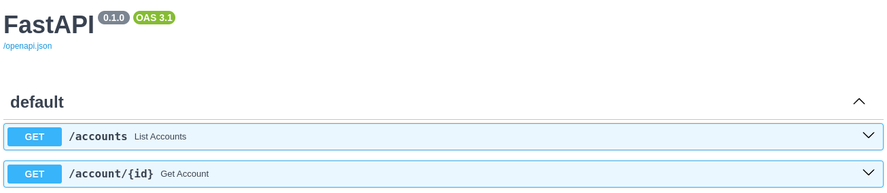

# Account manager

This repository contains a very basic account manager API. The account manager only allows to create and list accounts. Additionally, you can load a file with transactions and assing them to a selected account. Finally, the application can send a report summarizing the transactions of a given account via email.

## Getting started

To test the functionality of the account manager the first step is to clone/download this repository. Once you have done it, the following steps are required:

### Installing requirements

This project require the installation of the following tools

- docker

### Access credentials

Firstly, you will need to prepare the access credentials and a AWS S3 emulation. To this end, create and empty file named `.env` in the root path of this repository. Also you need to give execution permission to the file `start-localstack.sh`. In a GNU/Linux distribution this can be achieved by executing:

``` bash
chmod +x start-localstack.sh
```

Once done, execute the following command from the same path:

``` bash
docker compose up localstack
```

when it is ready, The S3 drive will be ready to be used and their access also will be ready. In the console where you executed the command a log like the one below will be shown, keep this information with you because it will be necessary to the next step.

``` json
{
    "AccessKey": {
        "UserName": "accmgr",
        "AccessKeyId": "your-access-key-id",
        "Status": "Active",
        "SecretAccessKey": "your-secret-access-key",
        "CreateDate": "2024-05-16T23:57:15Z"
    }
}
```

Additionally, an application password will be required to send reports from you own email account. Through this tutorial a Gmail account is used, but you can use your prefered email service. To create an application password for your Gmail account visit the following [link](https://accounts.google.com/v3/signin/challenge/pwd?continue=https://myaccount.google.com/apppasswords&service=accountsettings).

### Environment variables

If everything has gone smooth, the next step is to fill the information in the `.env` file created before. It must contain the following variaables:

``` python
# Database information
DB_USER=accmgr
DB_NAME=account_manager
DB_PASSWORD=# Set a custom password here
DB_HOST=db
DB_PORT=3306

# S3 access information
S3_ACCESS_KEY=# Place the value of AccessKeyId of previous step
S3_SECRET_KEY=# Place the value of SecretAccessKey of previous step

# Endpoint used to simulate S3 requests
BOTO3_ENDPOINT=http://localstack:4566

# Report information
# Fill with your email service information
REPORT_SMTP_SERVER=smtp.gmail.com
REPORT_SMTP_PORT=465
REPORT_EMAIL=example@gmail.com
REPORT_EMAIL_PASSWORD="your-app-password"
```

### Running account manager

With previous steps ready, is's time to test the application. The account manager require the following ports be available to work properly. These ports are:

- Port 80: Deploying the web services. Often these ports are used by some web servers like Apache, so, be sure to no other application is using it.
- Ports 3306 and 33060: Exposing the database server. Often these ports are used by other database servers, so, ensure no other DB service is running. Even when the exposition of this service is not mandatory, it was left in this way for testing purposes.
- Ports 4566 and 4510-4559: Required by [localstack](https://www.localstack.cloud/). This ports emulate some AWS services locally.

To run the application execute the following commands:

``` bash
# Build the docker images
docker compose build

# Deploy docker services
docker compose up
```

If everything was right, by accessing to `http://localhost/docs` you will see a screen looking like this:



It is an instance of Swagger, an API documentation tool, included with FastAPI. It allows to test the deployed endpoints in the account manager application.

## Account manager API
## Testing online


